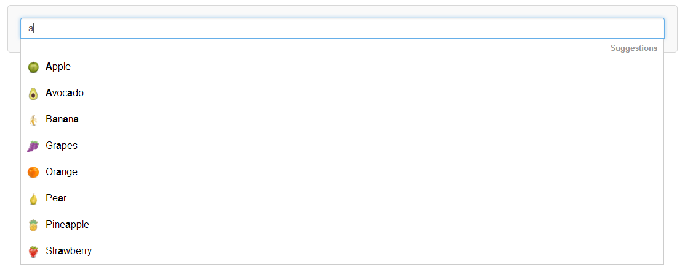

# suggestion-box

jQuery suggestion box plugin for search suggestions. 

Automatically makes suggestions based on user input.



**IMPORTANT: This plugin is still in development and is currently not stable.**

### Features:

- Highly configurable & flexible
- Suggestions can be provided by your own server side script, JSON file or direct input.
- Native filtering support
- Selection highlighting
- Keyboard controls
- Intuative & seamless mouse/keyboard control swap overs.
- Easy custom styling using css stylesheets

## Usage

Make sure you have included `jQuery` in your project: https://code.jquery.com. Then simply download and add the `css` & `js` files from the `dist` folder and add the following code to your page:

```
<link rel="stylesheet" href="path/to/css/suggestion-box.min.css"/>
<script src="path/to/js/suggestion-box.min.js"></script>
```

Then you need to add the following to your HTML:

`<input type="text" id="mySearch" />`

**Note:** `id` can be whatever you want, `mySearch` is only being used as an example.


### Loading suggestions from your own server side scripts

If you would like to get suggestions from your own server side script, you simply need to point to it using the `url` option.

`$('#mySearch').suggestionBox({url : 'path/to/script'});`
 
Make sure you are outputting the JSON in the correct format (see below). 

`Suggestion-box` automatically sends a `search` paramater in the `querystring` of the call to your script to allow you to retrieve the user input. You may change this paramater name if you wish using the `paramName` option.
 
 `$('#mySearch').suggestionBox({url : 'path/to/script', paramName: 'input'});`
 
#### Setting The Delay
 
Because retrieving your server side scripts requires an ajax call, `suggestion-box` will only get suggestions when the user is deemed to have stopped typing. By default this is when there hasn't been a keypress for 400ms. If you wish to change this you can set the `delay` option yourself.
 
`$('#mySearch').suggestionBox({url : 'path/to/script', input: 1000}); // Make request after 1 second`

## Pre-loading suggestions via JSON

If you would prefer to pre-load your suggestions you can do this using the `loadSuggestions` or add `addSuggestions` functions:


 `$('#mySearch').suggestionBox({filter: true}).loadSuggestions('path/to/my.json');`
 
 or
 
 ```
$('#mySearch').suggestionBox({filter: true}).addSuggestions(JSON.stringify(
    {
    "results": [
      {
        "suggestion": "Suggestion 1",
        "url": "suggestion1.html",
      },
      {
        "suggestion": "Suggestion 2",
        "url": "suggestion2.html"
      }
    ]
  }
));
 ```


### Filtering

You should note the use of the `filter` option in the above examples; you need to set this to `true` if you want to filter your suggestions automatically.

When set to true filtering is performed on each keypress so is more responsive than using a server side script. However, if you have a large data set to sift through you should do this from the server side to avoid potential performance issues.  

**Important:** If you do not set the `filter` option to true then no suggestions will be shown until you explicitly call the `showSuggestions()` method.

  
## JSON Format
 
JSON needs to be provided in in the following format:

```
{
  "results": [
    {
      "suggestion": "Suggestion 1",
      "url": "suggestion1.html",
      "attr" : [
        {
        "class" : "suggestion",
        "id" : "suggestion1",
        "anotherAttribute" : "foo"
        }
      ]
    },
    {
      "suggestion": "Suggestion 2",
      "url": "suggestion2.html"
    }
  ]
}
```


Where suggestion is the text of the suggestion box and url is the link location.

You may also add the optional "attr" option which allows you to add any attributes you want to the anchor tag (`<a>`)

e.g suggestion 1 above, would create the following HTML:

`<a href="suggestion1.html" class="suggestion" id="suggestion1" anotherAttribute="foo" >Suggestion 1</a>`


### Search Paramaters

You will most likely want to send the users search input to a server side script that searches a database or other storage system for relavant suggestions. By default the paramater sent will be `search` e.g.

`http://www.example.com/your_script?search={SEARCH_INPUT}`

Although you may change this to a value of your choosing using the paramName option e.g.:

```
$('#mySearch').suggestionBox({
  url : 'path/to/script',
  paramName: 'user_input'
});
```


### Available Options

The following options can be passed to the suggestion box

e.g. 

`$('#search').suggestionBox({optionName : value})`:

Option Name   | Description  | Default
------------- | -------------|------------
url           | The url of the JSON or server side script where you would like to make an ajax call to get the                        suggestions | null
heading       | The heading displayed in the suggestion box | Suggestions
results       | The maximum number of results to display in the suggestion box | 10
fadeIn        | Defines whether to apply a fade in effect to the suggestion box | true
fadeOut       |Defines whether to apply a fade out effect to the suggestion box | false
menuWidth     | How you would like the suggestion box width to be calculated, either: 'auto' - Browser automatically calculates the width based on content or 'constraint' - Constrain the suggestion box width to the search box width | auto
delay         | The number of milliseconds to wait until to consider the user to have stopped typing. An ajax call to                  the given suggestion url will be made after this time. | 400
topOffset     | The number of pixels you would like to move the suggestion boxs' top position | 0
leftOffset    | The number of pixels you would like to move the suggestion boxs' left position | 0
paramName     | The paramater name you would like to use in your query string for requests | search
ajaxError     | A function to define what should happen on ajax error, by default this performs a console.log() which will be overidden if supplied | function(data){...}
ajaxSuccess   | A function to define custom work to perform on ajax success. This will not override the default functionality | function(data){}
showNoSuggestionsMessage | Shows the noSuggestionsMessage when no suggestions can be found | false
noSuggestionsMessage | The message to be shown when no suggestions have been found and showNoSuggestionsMessage is true | No Suggestions Found


### Available Methods

The following methods can be used on the suggestion box e.g.:

```
var suggestionBox = $('#search').suggestionBox();
suggestionBox.getSuggestions('path/to.json');
```

Method  | Description  | Chainable
------------- | -------------|------------
getSuggestions(url) | Gets the suggestion from the given url | Yes
showSuggestions(suggestions) | Displays the suggestion box with the given suggestions| Yes
moveUp() | Moves the selected suggestion up by 1 | Yes
moveDown() | Moves the selected suggestion down by 1 | Yes
select(position) | Selects the suggestion at the given position | Yes
reset() | Resets selection to starting position. Note: this does not reset the json data | Yes
hide() | Hides the suggestion box | Yes
show() | Displays the suggestion box | Yes
fadeIn(bool) | Sets the value of the fadeIn option | Yes
fadeOut(bool) | Sets the value of the fadeOut option | Yes
delay(ms) | Sets the value of the delay option | Yes
heading(heading) | Sets the value of the heading option | Yes
results(results) | Sets the value of the results option | Yes
ajaxError(error) | Sets the ajaxError option | Yes
ajaxSuccess(success) | Sets the ajaxSuccess option | Yes
selectedUrl() | Returns the url of the selected suggestion | No
selectedSuggestion() | Returns the selected suggestion text | No 
position() | Returns the zero based list position of the selected suggestion | No
jsonData() | Returns the JSON object used to populate the suggestion box | No
destroy() | Destroys the suggestion box | No


### Styling the Suggestion Box

#### CSS
By default the stylesheet in miniturised, if you want to adjust any styles you can take a look at the non-miniturised css in `src/css` to help you see how styles have been applied.

#### SCSS/SASS

If you prefer you can download the scss from the `src/scss` which makes it easier to change any colours, but you will need to compile it to css.


## Creating your own builds

If you want to build your own version of `suggestion-box` or want to contribute, you will need to `clone` the repo.

#### Source files

The source files can be found in the `src` folder, which you are free to edit as you wish.

#### Installing Dependencies

Make sure you have `nodeJS` installed on your system: https://nodejs.org/

then run:

`npm install`

from the root directory.

### Gulp

`Suggestion-box` is built with gulp, so you can simply run `gulp` from the command line in the project root to create new builds from the `src`. You should not edit files in `src/css` directly as those are compiled from the `scss`, so will be overwritten when you run `gulp`.

The following gulp commands can be run:

`gulp` - Builds from `src/js` and `src/scss`

`gulp watch` - Watches for changes and automatcally create builds when files are saved

`gulp sass` - Builds the styles from .scss files in `src/scss`.

`gulp compress` - Builds the `js` distributables `src/js`

`gulp sass:watch` - Watch for changes on the `src/sass` files

`gulp js:watch` -  Watch for changes on the `src/js` files

`gulp test` - Run the tests

### Running tests

If you want to run the tests, then you can either run `gulp test` or `npm test` from the command line in the root.

You can also run `karma start` which will watch for any changes to the test files and run tests as they are changed.

<b>Note: </b> By default tests are run using `PhantomJS`. If you want to run them against other browsers you can add them to `browsers` section in `karma.conf.js`. All launchers have been included as devDependencies.
